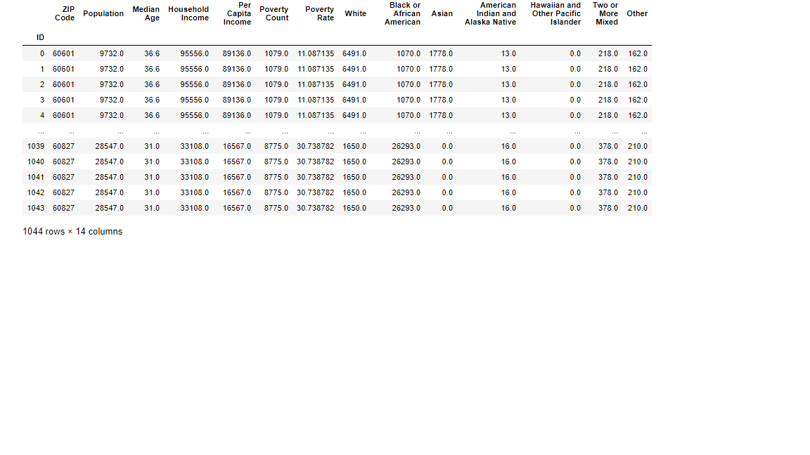
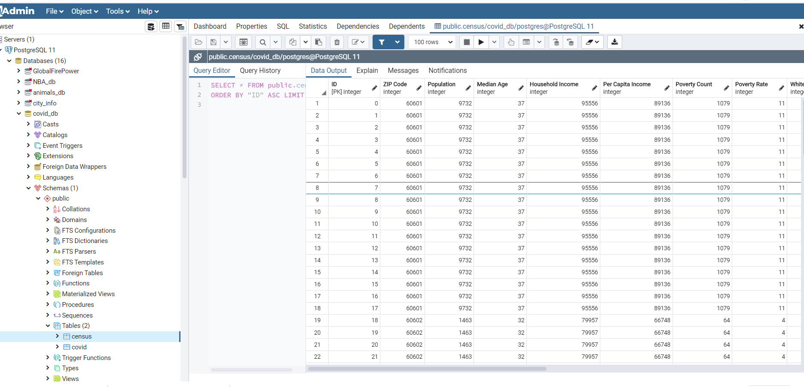

# Data Visualization Project- COVID-19-Dashboard for Chicago

In this project we built a web dashboard which shows the COVID-19 cases and testing centers for Chicago,IL.

## Data Collection
Covid Data-
https://data.cityofchicago.org/browse?limitTo=datasets&sortBy=alpha&tags=covid-19

Testing Sites-
https://data.cityofchicago.org/Health-Human-Services/COVID-19-Testing-Sites/thdn-3grx

Census Data Api- https://github.com/datamade/census

## Data Cleaning
Cleaned the Census data to get only Chicago zipcodes. Loaded the Covid data as well. Merged both to get a final dataframe.

## DataBase and Backend server
We used SQL database in Postgres to store the data and created a flask server to load the data into Python.

## Front end visualization
We used html, D3, Javascript, Plotly and Leaflet to build our final visualization dashboard.

## The visualization dashboard includes:
A dropdown menu to select the Chicago Zipcode. This modifies the plots for:
1. Line Chart: Postive Tested Rate And Death Rate
2. Bar Chart: COVID-19 Progression in Chicago
3. Doughnut Chart: Race Distribution by Zipcode
4. Table: Demographics per zipcode
5. Chicago Map: Testing sites
6. Chicago Map: Positive Cases concentration

